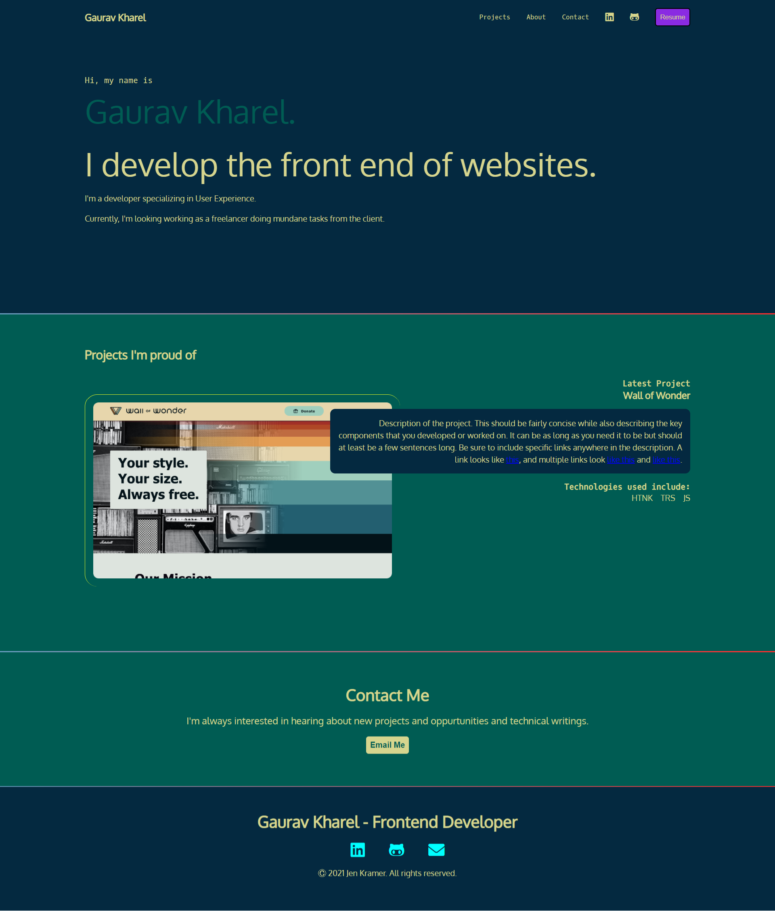

# Here's just me practicing CSS

## See some toggles as of now: 


## Screenshots




## Installation

It is just plain HTML and CSS proj but, I have used Vite Vanila JS boilerplate 
you can use it as:

Install 

```bash
  cd gaurav-doing-css
  npm install 
  npm run dev
```


    
